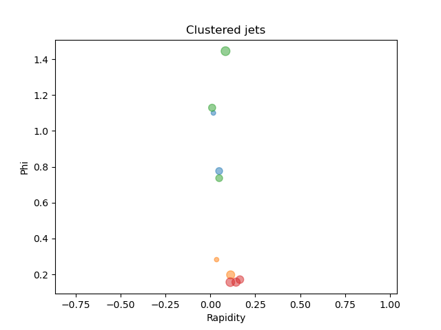

[](https://codecov.io/gh/HenryDayHall/spectraljet)
# Spectral clustering

A python algorithm for doing spectral clustering on jets.
This code was originally developed for the paper Spectral Clustering for Jet Physics, [https://doi.org/10.1007/JHEP02%282022%29165](https://doi.org/10.1007/JHEP02%282022%29165).
The paper motivates and described the algorithm.

Originally it was part of [Jet Tools](https://github.com/HenryDayHall/jetTools),
but that package includes a lot of machinery for analysis and hyper-parameter optimisation that
isn't essential to clustering, therefore this is a lightweight core just for the algorithm itself.

## Installation 

If you are looking to just use this package, not develop it, you should be able to just do;

```bash
pip install .
```
which will install all packages in `requirements.txt` then install this package in your python environment.

Then you should use an example to check it worked;
```bash
$ python3 examples/minimal_example.py
```

## Development

If you want to develop with this package, you will need to install the requirements in your python environment.
If you are using pip;
```bash
pip install -r requirements.txt
```

or using conda
```bash
conda install -c conda-forge --yes --file requirements.txt
```

## Examples

You can find a basic usage example in the examples folder.
Below is a very rudimentary summary.

Setting up and making some dummy data from a pretend event;
```python3
import numpy as np
from spectraljet import Components, FormJets
particle_pxs = np.array([99.38, 23.83, 15.44, 35.53, 91.63, 97.01, 40.14, 23.39, 60.08, 69.84])
particle_pys = np.array([90.21, 0.82, 24.83, 75.09, 81.73, 71.23, 68.33, 48.03, 94.47, 14.47])
particle_pzs = np.array([15.90, 5.11, 9.03, 83.61, 34.53, 52.26, 52.26, 91.19, 56.76, 5.39])
particle_energies = np.array([321.36, 145.06, 515.77, 739.28, 695.15, 616.06, 366.81, 557.71, 510.49, 518.79])
```

Define the parameters of the clustering algorithm
take a look at `FormJets.Spectral.permitted_values`
to see all possible choices.
Then run the clustering algorithm to make a bundle of jets.

```python3
spectral_clustering_parameters = {
                  'MaxMeanDist': 1.26,
                  'EigenvalueLimit': 0.4,
                  'Sigma': 0.15,
                  'CutoffKNN': 5,
                  'Beta': 1.4,
                  'ClipBeta': 1e-3,
                  'PhyDistance': 'angular',
                  'ExpofPhysDistance': 2.0,
                  'SingularitySuppression': 0.0001,
                  'Laplacian': 'symmetric_carried',
                  'EmbedDistance': 'root_angular',
                  'EmbedHardness': None,
                  'ExpofPTFormatInput': None,
                  'ExpofPTInput': 0,
                  'ExpofPTFormatAffinity': None,
                  'ExpofPTAffinity': 0.,
                  'ExpofPTFormatEmbedding': None,
                  'ExpofPTEmbedding': 0.,
                  }
jet_bundle = FormJets.Spectral.from_kinematics(particle_energies,
                                               particle_pxs,
                                               particle_pys,
                                               particle_pzs,
                                               dict_jet_params=spectral_clustering_parameters,
                                               run=True)  # tell it to cluster immediatly
```

Now this bundle contains all the jets in this event.
It can be split up into separate jets, each of which is plotted in a different colour.

```python3
seperate_jets = jet_bundle.split()  # break it into one object per jet
print(f"{len(seperate_jets)} jets have been formed")

from matplotlib import pyplot as plt

fig, ax = plt.subplots()
ax.axis('equal')
ax.set_xlabel("Rapidity")
ax.set_ylabel("Phi")
for jet in seperate_jets:
    ax.scatter(jet.Leaf_Rapidity, jet.Leaf_Phi, alpha=0.5, s=20*np.log(jet.Leaf_PT))
ax.set_title("Clustered jets")
```

This should result in a plot like;

